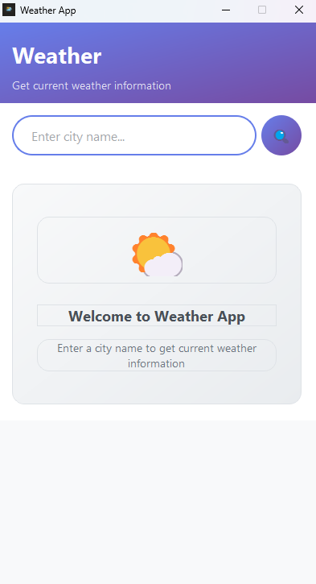
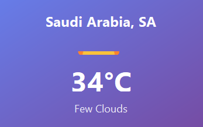
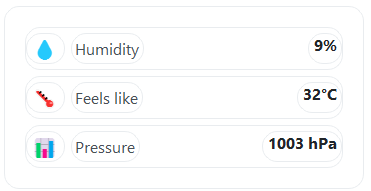

# 🌤️ Modern Weather App

<div align="center">

A beautiful, Android-style weather application built with PyQt5 that provides real-time weather information with a sleek, modern interface.


</div>


## ✨ Features

### 🎨 **Modern UI Design**
- **Material Design inspired** interface with gradient backgrounds
- **Card-based layout** for clean, organized information display
- **Smooth animations** and hover effects for better user experience
- **Responsive design** that adapts to different screen sizes
- **Android-style icons** and typography

### 🌍 **Weather Functionality**
- **Real-time weather data** from OpenWeatherMap API
- **Comprehensive weather information** including:
  - Current temperature and "feels like" temperature
  - Weather conditions with descriptive icons
  - Humidity levels
  - Atmospheric pressure
- **Global city support** - search for any city worldwide
- **Error handling** for invalid cities and network issues

### ⚡ **Performance & UX**
- **Threaded API calls** to prevent UI freezing
- **Loading states** with visual feedback
- **Instant search** with Enter key support
- **Clean, intuitive interface** suitable for all users

## 📸 Screenshots

<div align="center">

| Welcome Screen | Weather Display | Details View |
|:-------------:|:---------------:|:------------:|
|  |  |  |

*Replace these placeholder images with actual screenshots of your app*

</div>

## 🚀 Quick Start

### Prerequisites
- Python 3.7 or higher
- pip package manager

### Installation

1. **Clone the repository**
   ```bash
   git clone https://github.com/yourusername/modern-weather-app.git
   cd modern-weather-app
   ```

   > **Note**: Replace `yourusername` with your actual GitHub username

2. **Install dependencies**
   ```bash
   pip install -r requirements.txt
   ```

3. **Run the application**
   ```bash
   python weather_app.py
   ```

## 🔧 Configuration

### API Key Setup
The app uses the OpenWeatherMap API. The current API key is included for testing purposes, but for production use, you should:

1. Get your free API key from [OpenWeatherMap](https://openweathermap.org/api)
2. Replace the `API_KEY` variable in the code:
   ```python
   API_KEY = "your_api_key_here"
   ```

## 📋 Requirements

```
PyQt5
requests
python-dotenv
```

## 🏗️ Project Structure

```
modern-weather-app/
│
├── 📄 weather_app.py          # Main application file
├── 📋 requirements.txt        # Python dependencies  
├── 📖 README.md              # Project documentation
├── 📜 LICENSE                # MIT License file
├── 📁 screenshots/           # Application screenshots
│   ├── welcome-screen.png
│   ├── weather-display.png
│   └── details-view.png
└── 📁 .github/              # GitHub specific files
    └── ISSUE_TEMPLATE/
        ├── bug_report.md
        └── feature_request.md
```

## 💻 Usage

1. **Launch the application**
   - Run the Python script to open the weather app window

2. **Search for weather**
   - Enter any city name in the search field
   - Press Enter or click the search button (🔍)

3. **View weather information**
   - Current temperature and conditions
   - Additional details like humidity and pressure
   - Weather-appropriate icons and descriptions

## 🎯 Code Highlights

### Modern Architecture
- **Thread-safe design** with separate worker threads for API calls
- **Signal-slot pattern** for clean event handling
- **Modular code structure** with separate methods for UI components

### UI Components
- **Custom styled widgets** with CSS-like stylesheets
- **Responsive layouts** using PyQt5 layout managers
- **Gradient backgrounds** and modern color schemes
- **Interactive elements** with hover and click effects

### Error Handling
- **Network timeout protection** (10-second timeout)
- **User-friendly error messages** for various failure scenarios
- **Input validation** to ensure proper city name format

## 🔮 Future Enhancements

- [ ] **5-day weather forecast** display
- [ ] **Weather maps integration** with interactive maps
- [ ] **Location-based weather** using GPS coordinates
- [ ] **Weather alerts and notifications** for severe conditions
- [ ] **Multiple city management** with favorites list
- [ ] **Dark/Light theme toggle** for user preference
- [ ] **Weather history charts** and trends
- [ ] **Customizable units** (Celsius/Fahrenheit, km/h vs mph)

## 🤝 Contributing

We love contributions! 🎉 Here's how you can help make this project even better:

<details>
<summary><b>🚀 Quick Contribution Guide</b></summary>

### 🍴 Fork & Clone
1. **Fork this repository** by clicking the "Fork" button at the top right
2. **Clone your fork** locally:
   ```bash
   git clone https://github.com/YOUR_USERNAME/modern-weather-app.git
   cd modern-weather-app
   ```

### 🌿 Create a Branch
```bash
git checkout -b feature/amazing-new-feature
# or
git checkout -b bugfix/fix-important-bug
```

### ✨ Make Your Changes
- Write clean, well-commented code
- Follow existing code style and conventions
- Test your changes thoroughly

### 📝 Commit & Push
```bash
git add .
git commit -m "✨ Add amazing new feature"
git push origin feature/amazing-new-feature
```

### 🎯 Open a Pull Request
1. Go to your fork on GitHub
2. Click "New Pull Request"
3. Provide a clear description of your changes
4. Link any related issues

</details>

### 🎨 Development Guidelines
- 📏 Follow **PEP 8** style guidelines
- 💬 Add **meaningful comments** for complex logic
- 🧪 **Test thoroughly** on different operating systems
- 📚 **Update documentation** for new features
- 🐛 **Write bug reports** with reproduction steps

### 🏷️ Contribution Types
- 🐛 **Bug fixes** - Help us squash those pesky bugs
- ✨ **New features** - Add cool new functionality
- 📝 **Documentation** - Improve or translate docs
- 🎨 **UI/UX improvements** - Make it even more beautiful
- ⚡ **Performance** - Speed up the app
- 🧪 **Testing** - Add or improve test coverage

## 🐛 Known Issues

- **API rate limiting**: Free OpenWeatherMap accounts have request limits
- **Network dependency**: Requires internet connection for weather data
- **City name ambiguity**: Some city names may return unexpected locations

## 📝 License

This project is licensed under the MIT License - see the [LICENSE](LICENSE) file for details.

## 🙏 Acknowledgments

- **OpenWeatherMap** for providing the weather API
- **PyQt5 team** for the excellent GUI framework
- **Material Design** for UI/UX inspiration
- **Open source community** for continuous support and feedback

## 📞 Support & Community

<div align="center">

### 🆘 Need Help?

| Issue Type | Where to Go | Response Time |
|:----------:|:-----------:|:-------------:|
| 🐛 **Bug Reports** | [GitHub Issues](https://github.com/yourusername/modern-weather-app/issues) | 24-48 hours |
| 💡 **Feature Requests** | [GitHub Issues](https://github.com/yourusername/modern-weather-app/issues) | 2-5 days |
| ❓ **Questions** | [GitHub Discussions](https://github.com/yourusername/modern-weather-app/discussions) | 12-24 hours |
| 💬 **General Chat** | [GitHub Discussions](https://github.com/yourusername/modern-weather-app/discussions) | Community driven |

</div>

### 🚨 Before Creating an Issue
- ✅ **Search existing issues** to avoid duplicates
- ✅ **Use issue templates** for bug reports and feature requests
- ✅ **Provide detailed information** including:
  - Python version (`python --version`)
  - Operating system and version
  - PyQt5 version
  - Steps to reproduce the issue
  - Expected vs actual behavior

### 🤝 Community Guidelines
- **Be respectful** and constructive in all interactions
- **Help others** when you can - we're all learning together
- **Follow the code of conduct** (be awesome to each other!)
- **Share your creations** - show us what you've built with this app!

---

<div align="center">

**Made with ❤️ using Python and PyQt5**

*Bringing beautiful weather information to your desktop*

</div>